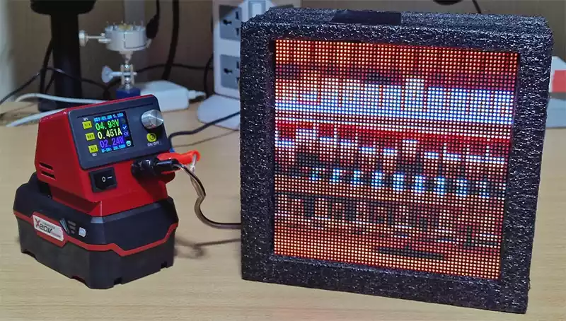

This app retrieves the 'now playing' track for a user from the LastFM API and displays it to a Flaschen-Taschen RGB matrix display.


_RGB display in prototype case showing album art from LastFM API_

# Configuration

Configuration parameters are applied using environment variables. You can provide these as a `.env` file in the project folder, or as variables in docker (recommended).

The following is a list of variables and their default values:

```bash
# Optional - defaults to false. Set `true` to enable debug console output.
CLIENT_DEBUG=true
# The frequency that the LastFM API is queried for updates.
# Ideally this would be a lesser value than the `--layer-timeout` parameter value set on your Flaschen-Taschen server.
# Optional - defaults to 10 seconds.
POLLING_FREQUENCY_SECS=10
# The host/ip address of your Flaschen-Taschen server
FLASCHEN_TASCHEN_HOST=my_ft_server_ip_or_hostname
# The port of your Flaschen-Taschen server
# Optional - defaults to 1337
FLASCHEN_TASCHEN_PORT=1337
# The width of your Flaschen Taschen Display (or the width that you want the image to be)
# Optional - defaults to 32
FLASCHEN_TASCHEN_WIDTH=64
# Image height
# Optional - defaults to 32
FLASCHEN_TASCHEN_HEIGHT=64
# The LastFM username to query for now playing
LASTFM_USER=my_last_fm_username
# Your API key for Last FM
# https://www.last.fm/api/account/create
LASTFM_APIKEY=my_last_fm_api_key
```

# Deployment

This app can be launched using any of the following methods below.

## Docker-compose (recommended)

Use the [`docker-compose.yaml` configuration](https://github.com/telekineticyeti/lastfm-nowplaying-rgbdisplay/blob/master/docker-compose.yaml) provided in this repo to
pull, build and deploy this app with docker-compose.

## Build and run with Docker

Configuration is provided via `-e` flags in docker create command.

```bash
# Either clone the repo and build the image
docker build . -t lastfm-nowplaying-rgbdisplay
# Alternatively, build the image directly from this repo url
docker build https://github.com/telekineticyeti/lastfm-nowplaying-rgbdisplay

# Create the container using the above image, with absolute minimal configuration
# (32x32 display, 10 second API polling frequency - see configuration above)
docker create \
 --name=lastfm-nowplaying \
 -e FLASCHEN_TASCHEN_HOST=192.168.0.100 \
 -e LASTFM_USER=your-lastfm-user-name \
 -e LASTFM_APIKEY=your-lastfm-api-key \
 --restart unless-stopped \
 lastfm-nowplaying-rgbdisplay

# Start the container
docker start lastfm-nowplaying
```

## Build and run with NodeJS

Clone the repo and execute the following commands:

```bash
# Install dependencies
npm install

# Run the development server
npm run start

# Run the deployment server
npm run deploy
```

# Known issues

- For unknown reasons, the LastFM API will occasionally return a now playing track for an incorrect user, or claim that the user does not exist.
  ```bash
  Error [6]: User not found
  ```
- The LastFM API occasionally will return error code 8
  ```bash
  Error [8]: Operation failed - Most likely the backend service failed. Please try again.
  ```
  As this issue appears to be intermittent and usually resolves after the next API poll, the error throw in the `nowPlaying()` try-catch was removed so that the app does not exit.
